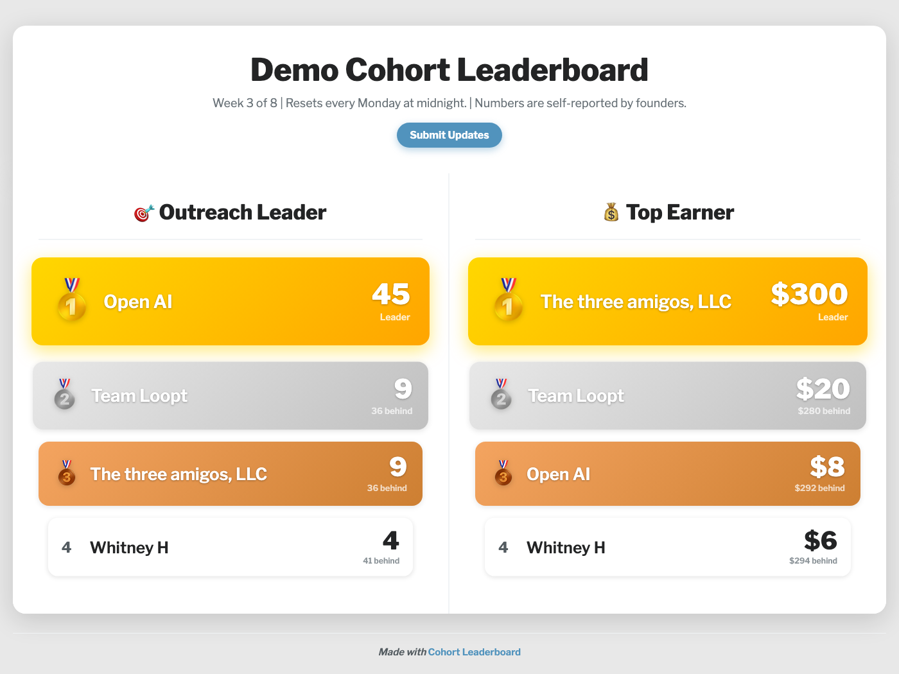

# Cohort Leaderboard

A live leaderboard for entrepreneur programs, accelerators, and cohort
courses. When founders can see where they stand, the pace of the whole
cohort changes: more outreach between sessions, more deals closed, more
progress to show when the group meets.

Founders submit their numbers through a Google Form. This page turns those
submissions into a ranked scoreboard (gold, silver, and bronze podium up
top, live score gaps below) that updates itself all week. It runs entirely
on a Google Sheet you already know how to edit. Free.

**[See a demo](https://cohort-leaderboard.netlify.app/?demo=1)** ·
**[Make your own](https://cohort-leaderboard.netlify.app/make.html)**



Built for the Round Rock pre-accelerator, where it goes up on the projector
at the start of every session.

## How it works

```
Google Form  →  Google Sheet  →  published CSV  →  this page
(founders submit) (you edit anytime)  (no login needed)   (live board)
```

- Every column in your form becomes its own leaderboard (outreach sent,
  revenue closed, interviews done, whatever you track).
- Columns with "revenue", "sales", "earner", or "$" in the header format as
  currency.
- Edit the Sheet directly anytime: fix a typo, delete a junk row, rename a
  team. The board follows.
- New submissions appear within about 5 minutes (Google caches published
  CSVs), and the page re-checks automatically, so a projector display stays
  current all session.

## Quickstart (no code, ~20 minutes)

### 1. Create your Form and Settings sheet

- Make a Google Form with a name question ("Your name or your company's
  name") plus one question per metric you want to track. Number answers work
  best. Under Responses, link it to a spreadsheet.
- Make a second, one-tab spreadsheet called Settings and fill column A per
  the table below (or copy the template linked in
  [docs/template-sheet-setup.md](docs/template-sheet-setup.md)).

Running a university program or anywhere real names are sensitive? Tell
participants to enter a company name or handle. The board shows whatever
they type.

### 2. Publish both as CSV

In each spreadsheet: **File > Share > Publish to web**, pick the tab (the
Form-responses tab in one, Settings in the other), choose
**Comma-separated values (.csv)**, publish, copy the URL.

If Publish to web is missing, your Google Workspace admin has disabled it;
redo the sheets from a personal Google account.

### 3. Get your link

Go to the **[leaderboard builder](https://cohort-leaderboard.netlify.app/make.html)**,
paste the two URLs, done. Bookmark the link it gives you; that's your live
board.

## Settings sheet reference (column A, one value per row)

| Row | Value |
|-----|-------|
| A1  | Board title |
| A2  | Date range / week label |
| A3  | Explainer text (appears after the date in the subtitle) |
| A4  | Disclaimer (footer small print) |
| A5  | "Powered by" text (blank = a small Cohort Leaderboard credit) |
| A6  | "Powered by" link URL |
| A7  | Submit button text (e.g. "Submit Updates") |
| A8  | Submit button URL (your Google Form link; blank hides the button) |
| A9  | Show "X behind" gap under scores: ON / OFF |
| A10 | Stack columns on mobile: ON / OFF |
| A11 | (reserved, leave blank) |
| A12 | Logo image URL for the footer (optional) |

## Self-hosting (optional)

The hosted builder needs no account at all. If you'd rather run it on your
own domain:

1. [Deploy to Netlify](https://app.netlify.com/start/deploy?repository=https://github.com/cameronha/cohort-leaderboard)
   (free tier is plenty), or drag this folder onto https://app.netlify.com/drop.
2. Copy `config.example.js` to `config.js`, paste your two published-CSV
   URLs, redeploy. With `config.js` set, the deployment serves only your
   board and ignores query params.

## Want help?

If you'd rather someone set this up for you, or you want help designing the
metrics, stakes, and cadence that make a leaderboard actually move a cohort,
reach out: [actionworks.co](https://actionworks.co).

## License

MIT. Use it, fork it, run your program on it.
